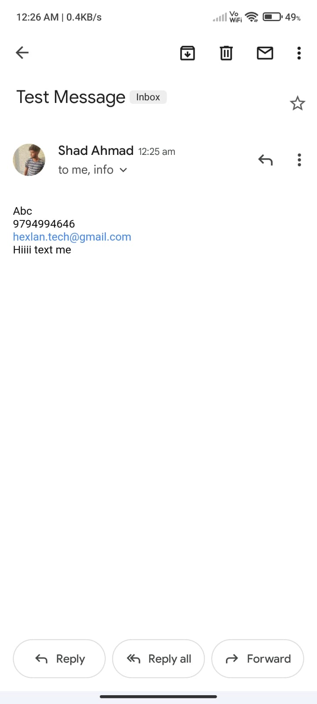

<h1>Linking Contact Form<h1>
<h3>Library used<h3>

I haved used linking API and email communication library for opening the mail into gmail

<h3>Description</h3>

It's basically a contact form in which user puts data to send directly from its gmail or any email app which is present on its device.

Also tried to implemet <b>Nodemailer Api</b> to send the contact from input to directly to recipient mailid 

<h4>Some ScreenShots</h4>

